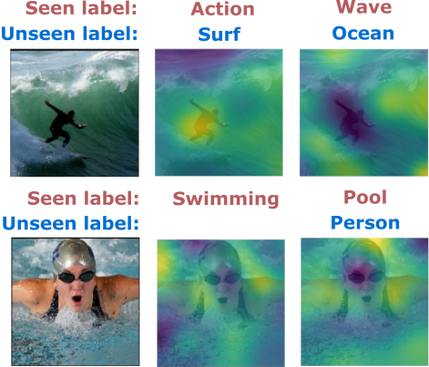

## About Me


Hi,<br>
I am a Ph.D. candidate at Khoury College of Computer Sciences, Northeastern University, advised by [Prof. Ehsan Elhamifar](https://www.ccs.neu.edu/home/eelhami/). 

I received my B.S. from University of Sciences (Viet Nam) where I was fortunate to study in Advanced Program in Computer Science.  

## Contact
If you are interested in my research or collaboration, I can be reached via:
+ Email: huynh [dot] dat [at] northeastern [dot] edu
+ [Linkedin](https://www.linkedin.com/in/dat-huynh-7709b116a/)

## Research Interest
My research interests lie in significantly reducing the amount of annotations needed to train deep learning systems for visual recognition, detection and segmentation tasks.<br>
Specifically, I design methods that decompose complex concepts into primitive components that can be combined to enable learning with few or zero training samples, with missing annotations and with weak supervision.

Research Areas:
+ Image/Video Recognition
+ Object Detection/Visual Grounding
+ Weakly-Supervised Learning

I am currently working on:
+ Interpreting and controlling machine predictions via novel attention mechanisms
+ Leveraging human knowledge in textual domain to recognize unseen concepts

## News
+ I am honored to receive ```J.P. Morgan PhD Fellowship 2021 Award``` supporting my works.
+ New paper on ```Compositional Learning``` is accepted at [neurIPS 2020](https://neurips.cc/Conferences/2020). Code is available on [Github](https://github.com/hbdat/neurIPS20_CompositionZSL).
+ New paper on ```Self-Supervised Multi-Task Procedure Learning from Instructional Videos``` is accepted at [ECCV 2020](https://eccv2020.eu/). Code is available on [Github](https://github.com/hbdat/eccv20_Multi_Task_Procedure_Learning).
+ Three papers including an oral presentation are accepted at [CVPR 2020](http://cvpr2020.thecvf.com/). Their codes are released on [Github](https://github.com/hbdat).

## Publications

<center>
"We can only see a short distance ahead,<br>
but we can see plenty there that needs to be done."
<br>
― Alan Turing, Computing machinery and intelligence, 1950 ―
</center>

<table> 
 
<tr> 
<td> 
<center>
<a href="https://github.com/hbdat/neurIPS20_CompositionZSL" style="color:blue;">[Project]</a> <br> 
<a href="pubs/suppmat_neurIPS20_compositionZSL_final.pdf" style="color:green;">[Supplementary Materials]</a><br> 
<a href="presentations/compositionalZSL_short.pdf" >[Slide]</a><br> 
</center> 
<br>
 
</td> 
<td> 
	<center> 
		<b>D. Huynh</b> and E. Elhamifar<br> 
		<a href="pubs/neurips20_CompositionZSL_final.pdf">Compositional Zero-Shot Learning via Fine-Grained Dense Feature Composition</a><br> 
		<br>NeurIPS 2020<br> 
	</center> 
	 
	<p> 
	<br><u>Description:</u> Developed a generative model that constructs fine-grained features for unseen classes by recombining features from training samples
	<br><br>  
	<u>Outcome:</u> Improved the state-of-the-art performance of unseen clothing recognition by 4% harmonic mean on DeepFashion dataset  
	</p> 
</td> 
</tr> 
 
<tr conference="ECCV20"> 
<td> 
<center>
<a href="https://github.com/hbdat/eccv20_Multi_Task_Procedure_Learning" style="color:blue;">[Project]</a>
</center>
<br>
 
</td> 
 
<td> 
	<center> 
		E. Elhamifar and <b>D. Huynh</b><br> 
		<a href="pubs/eccv20_seflsup_final.pdf">Self-Supervised Multi-Task Procedure Learning from Instructional Videos</a><br> 
		<br>ECCV 2020<br> 
	</center> 
	
	<p> 
	<br><u>Description:</u> Developed a weakly supervised key-frame localization method for multi-task procedure learning in videos  
	<br><br>  
	<u>Outcome:</u> Applied self-supervised learning on CrossTask and ProceL datasets to localize key-frames without human supervision  
	</p> 
</td> 
</tr> 
 
<tr conference="META20"> 
<td> 
 
</td> 
<td> 
	<center> 
		S. Jafar-Zanjani, M. M. Salary, <b>D. Huynh</b>, E. Elhamifar, and H. Mosallaei<br> 
		<a href="">Active Metasurfaces Design by Conditional Generative Adversarial Networks</a><br> 
		<br>International Conference on Metamaterials, Photonic Crystals and Plasmonics, 2020<br> 
	</center> 
</td> 
</tr> 
 
<tr conference="CVPR20"> 
<td> 
<center>
<a href="https://github.com/hbdat/cvpr20_LESA" style="color:blue;">[Project]</a> <br> 
<a href="pubs/suppmat_attentionZSL_final.pdf" style="color:green;">[Supplementary Materials]</a><br> 
<a href="presentations/shared_attention_short.pdf" >[Slide]</a><br> 
</center> 
<br>


</td> 

<td> 
	<center> 
		<b>D. Huynh</b> and E. Elhamifar<br> 
		<a href="pubs/cvpr20_attentionZSL_final.pdf">A Shared Multi-Attention Framework for Multi-Label Zero-Shot Learning</a><br> 
		
		<br>CVPR 2020<br> 
		<b>Oral Presentation</b><br> 
	</center> 
	 
	<p> 
	<br><u>Description:</u> Developed a multi-label recognition system for labels without training samples via attention sharing  
	<br><br>  
	<u>Outcome:</u> Improved the state-of-the-art performance by 2% mAP score on NUS-WIDE and scaled to 7000 seen labels and 400 unseen labels in Open Images  
	</p> 
</td> 
</tr> 
 
<tr conference="CVPR20"> 
<td> 
<center>
<a href="https://github.com/hbdat/cvpr20_DAZLE" style="color:blue;">[Project]</a> <br> 
<a href="pubs/suppmat_finegrainedZSL_final.pdf" style="color:green;">[Supplementary Materials]</a><br> 
<a href="presentations/dense_attention_short.pdf" >[Slide]</a><br> 
</center> 
<br>
 
</td> 
<td> 
	<center> 
		<b>D. Huynh</b> and E. Elhamifar<br> 
		<a href="pubs/cvpr20_finegrainedZSL_final.pdf">Fine-Grained Generalized Zero-Shot Learning via Dense Attribute-Based Attention</a><br> 
		
		<br>CVPR 2020<br> 
	</center> 
	 
	<p> 
	<br><u>Description:</u> Developed a dense attribute-based attention mechanism for fine-grained zero-shot learning   
	<br><br>  
	<u>Outcome:</u> Improved state-of-the-art performances on CUB, AWA2 by at least 4% harmonic mean by weakly localizing fine-grained attributes of all classes    
	</p> 
</td> 
</tr> 
 
<tr conference="CVPR20"> 
<td> 
<center>
<a href="https://github.com/hbdat/cvpr20_IMCL" style="color:blue;">[Project]</a> <br>
<a href="pubs/suppmat_ssmll_final.pdf" style="color:green;">[Supplementary Materials]</a><br> 
<a href="presentations/ssmll_short.pdf" >[Slide]</a><br> 
</center> 
<br>
 
</td> 
<td> 
	<center> 
		<b>D. Huynh</b> and E. Elhamifar<br> 
		<a href="pubs/cvpr20_ssmll_final.pdf">Interactive Multi-Label CNN Learning with Partial Labels</a><br> 
		
		<br>CVPR 2020<br> 
	</center> 
	 
	<p> 
	<br><u>Description:</u> Developed a scalable graph-based framework to regularize multi-label CNN learning with missing labels  
	<br><br>  
	<u>Outcome:</u> Improved 2% mAP score on Open Images compared to treating missing labels as absent labels  
	</p> 
</td> 
</tr> 
 
<tr conference="ICCVW19"> 
<td> 
 
</td> 
<td> 
	<center> 
		<b>D. Huynh</b> and E. Elhamifar<br> 
		<a href="pubs/iccvw19_attentionZSL.pdf">Seeing Many Unseen Labels via Shared Multi-Attention Models</a><br> 
		<br>ICCVW 2019 
		<br> 
		<br> 
		Workshop on Multi-Discipline Approach for Learning Concepts - Zero-Shot, One-Shot, Few-Shot and Beyond<br> 
	</center> 
</td> 
</tr> 
</table>

## Services
I am always proud of serving the research community as:
+ Internal Reviewer: WACV20, ICPR20, IJCAI21
+ External Reviewer: CVPR, ECCV, ICCV, NeurIPS, ICML, AISTATS
