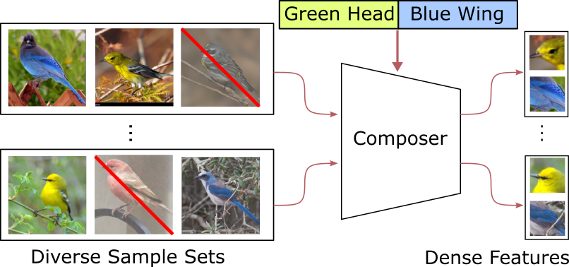
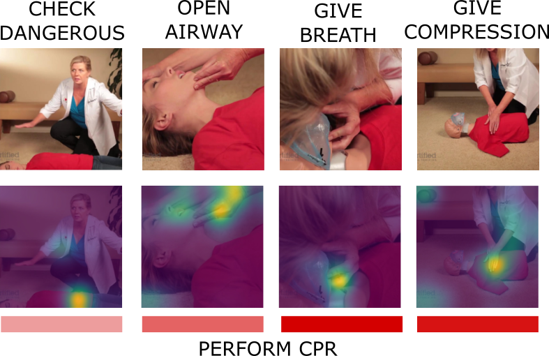
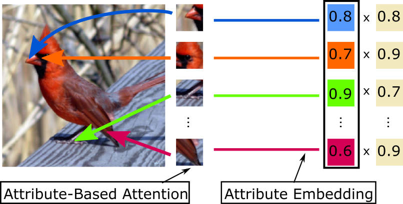

<table>

<tr>
<td>

</td>
<td>
	

		<b>D. Huynh</b> and E. Elhamifar 
		<a href="">Dense Feature Composition for Zero-Shot Learning</a> 
		(to appear in Neural Information Processing Systems, 2020). 
	

	
	

	 <u>Description:</u> Developed a novel generative model that constructs features of unseen classes by combining features from seen classes 
	   
	<u>Outcome:</u> Improved the state-of-the-art performance of unseen clothing recognition by 4% harmonic mean on DeepFashion dataset 
	

</td>
</tr>

<tr conference="ECCV20">
<td>

</td>

<td>
	

		E. Elhamifar and <b>D. Huynh</b> 
		<a href="pubs/eccv20_seflsup_supmat_final.pdf">Self-Supervised Multi-Task Procedure Learning from Instructional Videos</a> 
		<a href="https://gitdub.com/hbdat/eccv20_Multi_Task_Procedure_Learning" style="color:blue;">[Project]</a> 
		European Conference on Computer Vision, 2020. 
	

	
	

	 <u>Description:</u> Developed a weakly supervised key-frame localization method for multi-task procedure learning in videos 
	   
	<u>Outcome:</u> Applied self-supervised learning on CrossTask and ProceL datasets to localize key-frames without human supervision 
	

</td>
</tr>

<tr conference="META20">
<td>

</td>
<td>
	

		S. Jafar-Zanjani, M. M. Salary, <b>D. Huynh</b>, E. Elhamifar, and H. Mosallaei 
		<a href="">Active Metasurfaces Design by Conditional Generative Adversarial Networks</a> 
		International Conference on Metamaterials, Photonic Crystals and Plasmonics, 2020. 
	

</td>
</tr>

<tr conference="CVPR20">
<td>

</td>
<td>
	

		<b>D. Huynh</b> and E. Elhamifar 
		<a href="pubs/cvpr20_attentionZSL_final.pdf">A Shared Multi-Attention Framework for Multi-Label Zero-Shot Learning</a> 
		<a href="https://gitdub.com/hbdat/cvpr20_LESA" style="color:blue;">[Project]</a>
		<a href="pubs/suppmat_attentionZSL_final.pdf" style="color:green;">[Supplementary Materials]</a> 
		IEEE Conference on Computer Vision and Pattern Recognition, 2020. 
		<b>Oral Presentation</b> 
	

	
	

	 <u>Description:</u> Developed a multi-label recognition system for labels without training samples via attention sharing 
	   
	<u>Outcome:</u> Improved the state-of-the-art performance by 2% mAP score on NUS-WIDE and scaled to 7000 seen labels and 400 unseen labels in Open Images 
	

</td>
</tr>

<tr conference="CVPR20">
<td>

</td>
<td>
	

		<b>D. Huynh</b> and E. Elhamifar 
		<a href="pubs/cvpr20_finegrainedZSL_final.pdf">Fine-Grained Generatrzed Zero-Shot Learning via Dense Attribute-Based Attention</a> 
		<a href="https://gitdub.com/hbdat/cvpr20_DAZLE" style="color:blue;">[Project]</a>
		<a href="pubs/suppmat_finegrainedZSL_final.pdf" style="color:green;">[Supplementary Materials]</a> 
		IEEE Conference on Computer Vision and Pattern Recognition, 2020. 
	

	
	

	 <u>Description:</u> Developed a dense attribute-based attention mechanism for fine-grained zero-shot learning  
	   
	<u>Outcome:</u> Improved state-of-the-art performances on CUB, AWA2 by at least 4% harmonic mean by weakly localizing fine-grained attributes of all classes   
	

</td>
</tr>

<tr conference="CVPR20">
<td>

</td>
<td>
	

		<b>D. Huynh</b> and E. Elhamifar 
		<a href="pubs/cvpr20_ssmll_final.pdf">Interactive Multi-Label CNN Learning witd Partial Labels</a> 
		<a href="https://gitdub.com/hbdat/cvpr20_IMCL" style="color:blue;">[Project]</a>
		<a href="pubs/suppmat_ssmll_final.pdf" style="color:green;">[Supplementary Materials]</a> 
		IEEE Conference on Computer Vision and Pattern Recognition, 2020. 
	

	
	

	 <u>Description:</u> Developed a scalable framework for multi-label CNN training with missing labels 
	   
	<u>Outcome:</u> Improved 2% mAP score on Open Images compared to treating missing labels as absent labels 
	

</td>
</tr>

<tr conference="ICCVW19">
<td>

</td>
<td>
	

		<b>D. Huynh</b> and E. Elhamifar 
		<a href="pubs/iccvw19_attentionZSL.pdf">Seeing Many Unseen Labels via Shared Multi-Attention Models</a> 
		International Conference on Computer Vision Workshop, 2019 
		Workshop on Multi-Discipline Approach for Learning Concepts - Zero-Shot, One-Shot, Few-Shot and Beyond. 
	

</td>
</tr>
</table>